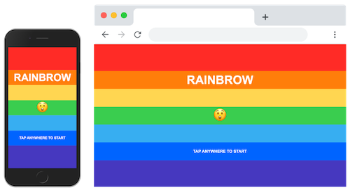

# Rainbrow clone

Quick clone of the [iOS game Rainbrow](https://apps.apple.com/au/app/rainbrow/id1312458558) by [Nathan Gitter](http://nathangitter.com/) using web technologies.

## Tech stack

* HTML
* CSS
* Vanilla JavaScript with the [face-api.js](https://github.com/justadudewhohacks/face-api.js) framework for facial expression detection

## Commands

The original iOS game works with detecting the brows but the face-api framework works with expression detection so it's a little different:

* Frowning (sad) <-> Move down
* Looking surprised <-> Move up
* Neutral <-> Stay in place

## Tested on

Desktop:

- Chrome 79
- Firefox 71
- Safari 12.1.1

Mobile:

- Chrome 79 on Android 10
- Safari 13 on iPad

